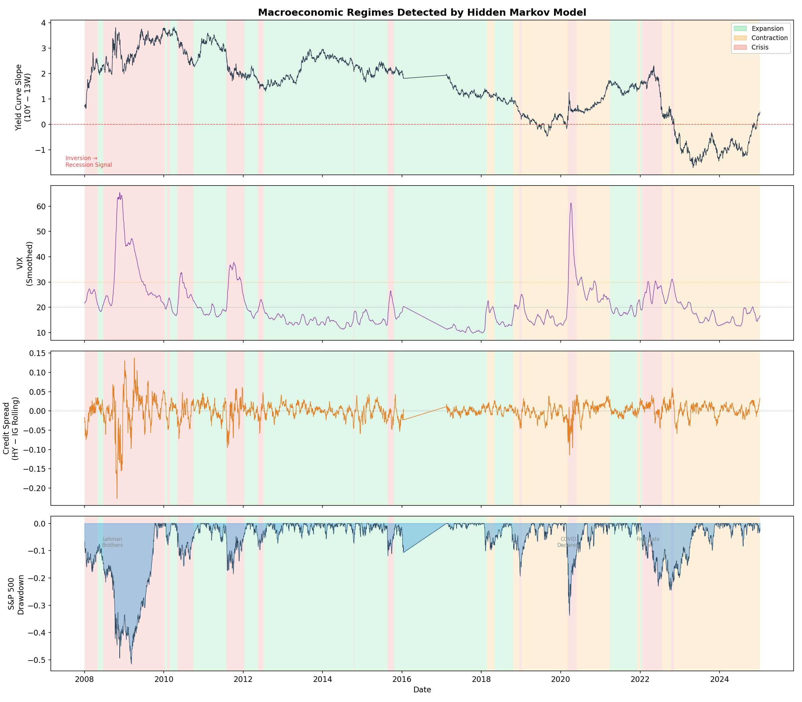
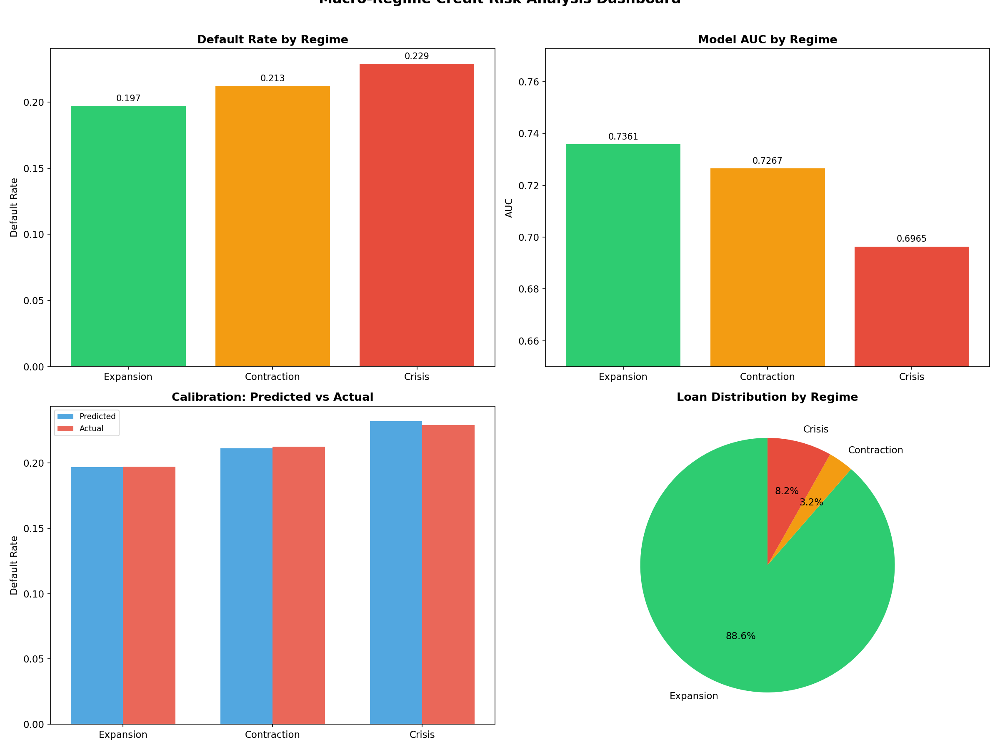
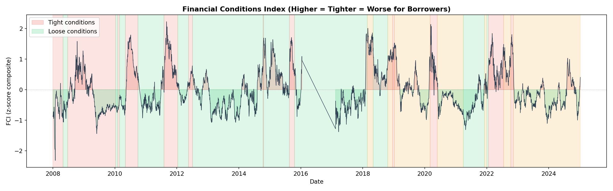

# Credit Risk, Fairness & Macro-Regime Analysis

<p align="center">
  
</p>

**A credit risk system that predicts defaults, audits itself for demographic bias, and stress-tests performance across economic regimes.**

Built with XGBoost, Hidden Markov Models, Yahoo Finance data, SHAP explainability, and fairness-aware evaluation aligned with CFPB and EU AI Act regulatory requirements.

---

## What Makes This Different

Most student credit risk projects train a model, report AUC, and stop. This project asks the questions that bank model risk teams actually ask:

1. **Is the model fair?** — Fairness auditing across demographic groups with per-group threshold optimization
2. **Does it work in a crisis?** — Regime-conditional evaluation showing how model performance degrades under economic stress
3. **Can you explain it?** — SHAP-based explanations for every prediction, aligned with ECOA adverse action requirements

The result: a model that's been validated not just on average, but across the specific macro scenarios regulators require (CCAR, DFAST, CECL).

---

## Key Findings

### Credit Risk Model

| Model | AUC | DP Gap | EO Gap |
|-------|-----|--------|--------|
| XGBoost (unconstrained) | 0.722 | 0.052 | 0.029 |
| XGBoost (fair thresholds) | 0.722 | 0.029 | 0.141 |
| LightGBM (unconstrained) | 0.721 | 0.050 | 0.028 |
| LightGBM (fair thresholds) | 0.721 | 0.029 | 0.141 |

> **Key finding:** Threshold adjustment reduced the demographic parity gap by 44% (from 0.052 to 0.029) with zero AUC loss. However, this increased the equal opportunity gap — demonstrating the fairness impossibility theorem.

### Macro-Regime Analysis

<p align="center">
  
</p>

| Metric | Expansion | Contraction | Crisis |
|--------|-----------|-------------|--------|
| Default Rate | 19.7% | 21.3% | 22.9% |
| Model AUC | 0.7361 | 0.7267 | 0.6965 |
| Calibration Error | −0.0002 | −0.0012 | +0.0028 |
| 4/5ths Rule | PASSES | PASSES | PASSES |

> **Key finding:** The model loses 4 points of AUC during economic crises (0.736 → 0.697). Default rates are 1.16× higher during Crisis vs Expansion. The model's discriminative power degrades exactly when accurate predictions matter most — which is why banks stress-test models against adverse scenarios.

### Regime Detection

A 3-regime Gaussian Hidden Markov Model trained on yield curve dynamics, credit spreads, VIX, and equity momentum from Yahoo Finance correctly identified all major economic events without supervision:

- ✓ **2008 GFC** — classified as 89.7% Crisis
- ✓ **2020 COVID** — classified as 66.1% Contraction + 33.9% Crisis
- ✓ **2022 Rate Shock** — classified as 49.5% Contraction + 47.0% Crisis

<p align="center">
  
</p>

---

## Architecture
```
Yahoo Finance API                     Lending Club (1.3M loans)
(9 tickers, 15 features)             (25+ engineered features)
    │                                        │
    ▼                                        ▼
┌─────────────────┐               ┌─────────────────────┐
│  Macro Data     │               │  Credit Risk Model   │
│  Pipeline       │               │  XGBoost / LightGBM  │
│  (yield curve,  │               │  + SHAP explainer    │
│   VIX, credit   │               │  + fairness auditing │
│   spreads)      │               └──────────┬──────────┘
└────────┬────────┘                          │
         │                                    │
         ▼                                    │
┌─────────────────┐                           │
│ Regime Detector │                           │
│ Gaussian HMM    │                           │
│ (3 regimes:     │                           │
│  Expansion,     │                           │
│  Contraction,   │                           │
│  Crisis)        │                           │
└────────┬────────┘                           │
         │              ┌─────────────────┐   │
         └──────────────▶ Regime-Credit   ◀───┘
                        │ Analysis        │
                        │ • AUC by regime │
                        │ • Calibration   │
                        │ • Fairness      │
                        │ • Stress testing│
                        └────────┬────────┘
                                 │
                    ┌────────────┴────────────┐
                    ▼                         ▼
           ┌──────────────┐         ┌─────────────────┐
           │  Streamlit   │         │  Visualizations  │
           │  Dashboard   │         │  (8 charts)      │
           └──────────────┘         └─────────────────┘
```

## Macro Indicators (Yahoo Finance)

| Ticker | Indicator | Economic Rationale |
|--------|-----------|-------------------|
| `^TNX` | 10Y Treasury Yield | Benchmark lending rate; drives mortgage and loan pricing |
| `^IRX` | 13W T-Bill Rate | Short-end rate; yield curve slope = `^TNX − ^IRX` |
| `^FVX` | 5Y Treasury Yield | Mid-curve flattening signal |
| `^VIX` | Volatility Index | Market fear → credit tightening → defaults rise |
| `HYG` | High-Yield Bond ETF | Junk bond proxy; sells off during stress |
| `LQD` | Investment-Grade Bond ETF | Credit spread = `HYG − LQD` returns |
| `SPY` | S&P 500 | Equity market health; wealth effect on borrowers |
| `GLD` | Gold ETF | Flight to safety signal |
| `DX-Y.NYB` | US Dollar Index | Strong dollar tightens global credit |

## Quick Start
```bash
# Clone the repo
git clone https://github.com/AmaarAyoob1/credit-risk-fairness-regimes.git
cd credit-risk-fairness-regimes

# Install dependencies
pip install -r requirements.txt

# Download Lending Club data (requires Kaggle credentials)
python src/data_pipeline.py --download

# Train credit risk models
python src/train.py

# Launch fairness dashboard
streamlit run streamlit_app/app.py

# Run macro-regime analysis
cd macro-regime
pip install -r requirements.txt
python run_analysis.py --regimes-only    # Regime detection only
python run_bridge.py                      # Full credit-regime analysis
python generate_charts.py                 # Generate all visualizations
```

## Project Structure
```
credit-risk-fairness-regimes/
├── README.md
├── requirements.txt
├── configs/
│   └── config.yaml                    # Model & pipeline configuration
├── data/
│   └── README.md                      # Data download instructions
├── src/
│   ├── data_pipeline.py               # Data cleaning & feature engineering
│   ├── features.py                    # Feature engineering functions
│   ├── train.py                       # Model training with fairness constraints
│   ├── evaluate.py                    # Evaluation metrics
│   ├── fairness.py                    # Fairness metric calculations
│   └── explain.py                     # SHAP explanations
├── streamlit_app/
│   └── app.py                         # Interactive fairness dashboard
├── macro-regime/                      # ← Macro-regime extension
│   ├── configs/config.yaml            # Tickers, HMM params, stress scenarios
│   ├── src/
│   │   ├── data_pipeline.py           # Yahoo Finance ingestion + features
│   │   ├── regime_detector.py         # HMM regime detection + validation
│   │   ├── regime_credit_analysis.py  # Regime-conditional credit analysis
│   │   └── visualizations.py          # Publication-quality charts
│   ├── run_analysis.py                # Full macro pipeline
│   ├── run_bridge.py                  # Credit model ↔ regime connector
│   ├── generate_charts.py             # Generate all 8 visualizations
│   └── figures/                       # Generated charts
└── tests/
    ├── test_features.py
    ├── test_fairness.py
    └── test_pipeline.py
```

## Technical Details

### Credit Risk Model
- **Data:** 1.3M Lending Club loans (2007–2018), 25+ engineered features
- **Models:** XGBoost and LightGBM with Optuna hyperparameter optimization
- **Fairness:** Three debiasing approaches — threshold adjustment, reweighting, constrained optimization
- **Explainability:** SHAP TreeExplainer for global/local feature importance

### Regime Detection
- **Data:** 9 Yahoo Finance tickers, 15 engineered macro features, 3,990 trading days (2008–2025)
- **Model:** Gaussian HMM with full covariance, 3 components, 10 random restarts
- **Features:** Yield curve slope, rolling credit spread, smoothed VIX, 60-day S&P 500 return
- **Validation:** 3/3 known economic events correctly classified without supervision
- **Financial Conditions Index:** Equal-weighted z-score composite of yield curve, credit spread, VIX, and equity momentum

### Regime-Credit Integration
- **Loan-regime mapping:** Each of 1.3M loans matched to the economic regime active at origination via nearest-date join
- **Regime-conditional evaluation:** AUC, calibration error, and fairness metrics computed per regime
- **Key result:** AUC degrades 0.040 from Expansion to Crisis; default rate 1.16× higher during Crisis

## Fairness Metrics

| Metric | What It Measures | Target |
|--------|-----------------|--------|
| **Demographic Parity** | Are approval rates equal across groups? | Gap < 0.05 |
| **Equal Opportunity** | Are true positive rates equal across groups? | Gap < 0.05 |
| **Predictive Parity** | Is precision equal across groups? | Gap < 0.05 |
| **Calibration** | Are predicted probabilities accurate across groups? | Gap < 0.03 |

## Regulatory Context

This project is informed by:
- **CFPB Circular 2022-03** — adverse action notices for AI-driven lending
- **ECOA / Regulation B** — prohibition of discrimination in credit decisions
- **EU AI Act (2024)** — high-risk AI system requirements for credit scoring
- **SR 11-7 (OCC/Fed)** — model risk management guidance
- **CCAR/DFAST** — Federal Reserve stress testing requirements for bank capital adequacy

## Dashboard

<p align="center">
  
  
</p>

## Author

**Ayoob Amaar** — MS Statistics & Machine Learning | MS Financial Engineering, Claremont Graduate University

## License

MIT License — see [LICENSE](LICENSE) for details.
